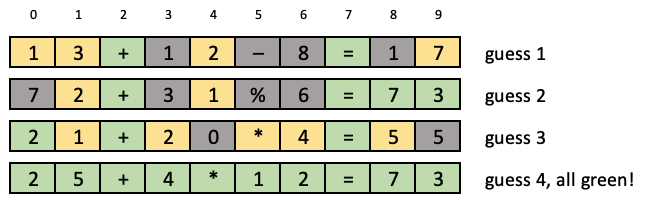

# COMP10001 2023 Sem1 project2:

All problem statements are paraphrased from UoM COMP10001 project.

## Main Problem statement: 
Create a guess_maker (software agents) playing & winning the game FocDle (Similar to Wordle)
in the least possible moves.

## Context - Rules of FoCDle:

In wordle, the target string is a word, and each of your guesses is also a word. 

In a FoCdle the target string is a simple math equation of a known length (measured in characters), and each of your guesses must also be math equations of the same length.

Each cell in the FoCdle contains a single digit, or one of four possible operators "+-*%", or an "=" relationship. 

The format of the FoCdle is always: 
```
<value> <operator> <value> <operator> <value> = <result>
```
 That is, each FoCdle always has exactly two operators, one equality, three values, and one result. 
 
 Each value is an integer between 1 and 99 inclusive, expressed in the minimum number of digits (no leading zeros). 
 
 The result is a non-zero non-negative integer also expressed without any leading zeros. 
 
 The four possible operators are "+", "-", " * ", "%", all with exactly the same interpretation as in Python, and with the same precedence as in Python (" * " and "%" are carried out before either of "+" or "-").

 

After each guess, the correct digit in correct location is marked green, correct digit in incorrect location is marked yellow and incorrect digit in incorrect location is marked grey.

Those info should be used to guide the next guess.

## Project structure

### Files:
1. project2_helper_functions.py: Helper functions to stimulate the games.
2. testing: Combine helper functions together to test the guess_makers.

## Directories:
1. guess_makers: The best guess_makers is better_guess_v2.py (Others are older/ simpler guess_makers for assignments/ testing).
2. restrictions_validator: Parse obtained colour info from previous guesses to validate if a guess is valid or not. Used in addition to the simple_guess version, and incorporated directly into better_guess.
3. pre_calc_info: Little boost using frequency analysis.

## Intuition of better_guess_v2.py:
1. Use first 2 guesses to find possible operators, and the equal positions. From 3rd guess, try to make correct guesses.
2. Apply multiple restrictions on format/ value to get all valid_values.
3. Sort the possible values in each position based on the frequency analysis.
4. Get the best sequences that passes all restrictions (and have the higher probability to occur + preference for including unused digits).

Technical details included in file. Could increase max_check (line 251) for better performance, but at lower speed.

## Results:
For a quick and simple test in testing:
```
Time per guess: 0.006549041271209716
Error count: 0
Average guess of 4.46120038456256 for 7281 secrets
Max guesses: 8
Min guesses: 3
```

Some secrets (at short length) are time-consuming to generate, so might be skipped. Exhaustive testing to be done in the future :D

Managed to get into top 10 of class. Top 1 code here: https://github.com/Troppydash/FoCdle.git
